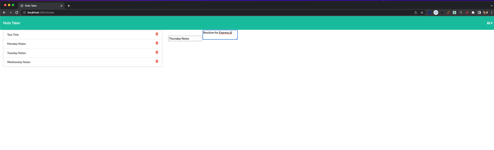
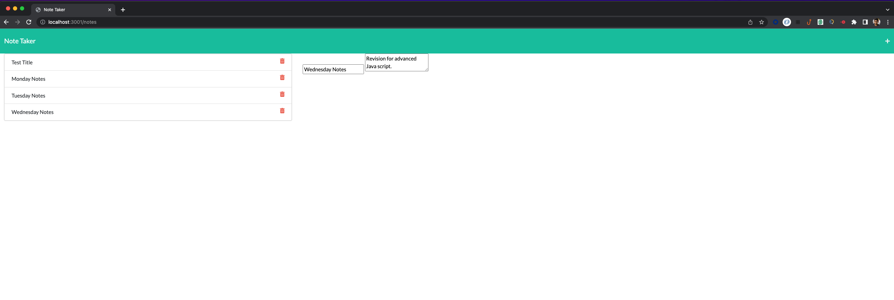

# Note-Taker
## Description:
This is a simple note taker application that allows users to add, view saved notes and delete any particular note .This application uses an express server to save and retrieve note data from a JSON file.

# Usage :

* Clone this repository to use this application on local machine.

* To install necessary dependencies, run the following command :

```
npm i
```

* The application will be invoked with the following command: This will start localhost server on PORT 3001.

```
node server.js


* Open browser and type `http://localhost:3001/` to run this application on your local machine.


# Demo :
![Note Taker]




# User Story

```
AS A user, I want to be able to write and save notes.

I WANT to be able to delete notes I've written before.

SO THAT I can organize my thoughts and keep track of tasks I need to complete
```

# Business Context

* For users that need to keep track of a lot of information, it's easy to forget or be unable to recall something important. 

* Being able to take persistent notes allows users to have written information available when needed.

